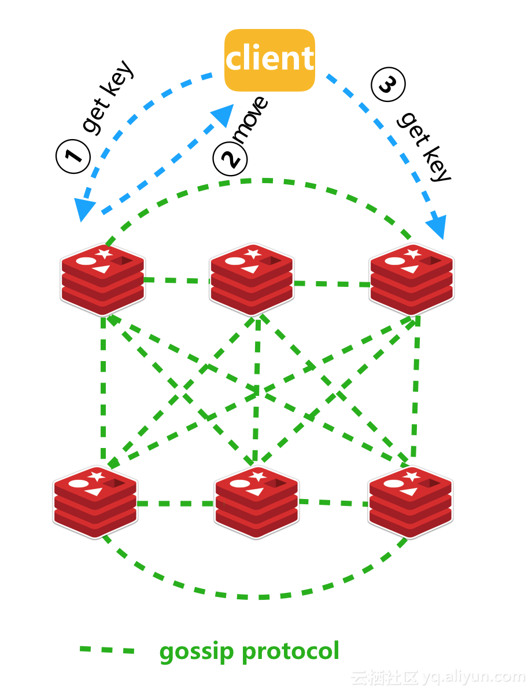
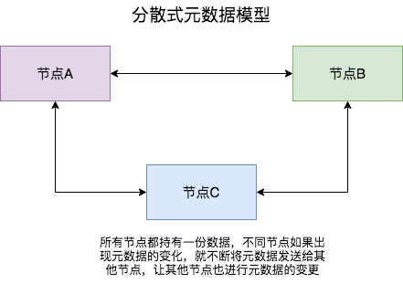
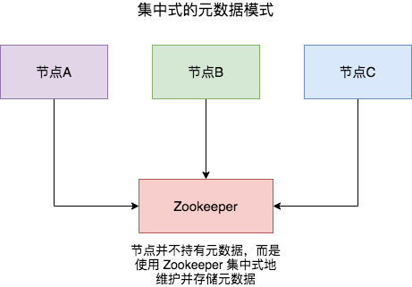

# Redis 源码分析

## Makefile 分析

GNU Make 手册  
https://www.gnu.org/software/make/manual/

Makefile 默认目标  
https://www.gnu.org/software/make/manual/make.html#How-Make-Works

Makefile 特别目标  
https://www.gnu.org/software/make/manual/make.html#Special-Targets

Nakefile 递归展开和简单展开变量  
https://www.gnu.org/software/make/manual/make.html#Flavors

Makefile 自动变量  
https://www.gnu.org/software/make/manual/make.html#Automatic-Variables

Makefile 变量覆盖  
https://www.gnu.org/software/make/manual/make.html#Overriding

Makefile 注释  
https://www.gnu.org/software/make/manual/make.html#Makefile-Contents

## Redis 图形化客户端

https://github.com/uglide/RedisDesktopManager  
https://github.com/qishibo/AnotherRedisDesktopManager

## C语言

- GNU c 手册或参考  
  https://www.gnu.org/software/gnu-c-manual/gnu-c-manual.html
- GNU libc (aka glibc) 文档  
  https://www.gnu.org/software/libc/manual/
- Linux man-pages 项目  
  https://www.kernel.org/doc/man-pages/
- GNU libc 整数  
  https://www.gnu.org/software/libc/manual/html_node/Integers.html
  

查看预定义宏 `gcc -dM -E xxx.c`

## Redis 六个命令

- redis-server -> src/server.c
- redis-cli -> src/redis-cli.c
- redis-benchmark -> src/redis-benchmark.c
- redis-sentinel 是 redis-server 的软链接
- redis-check-rdb 是 redis-server 的软链接
- redis-check-aof 是 redis-server 的软连接

## Redis String 字符串

- 整型字符串 未超过 LONG_MAX 使用 int 直接存在 RedisObject的ptr成员变量位置
- 普通字符串 不超过44个字节 使用 embstr 直接存在 RedisObject的末尾 总共最大64个字节
- 普通字符串 超过44个字节 使用 raw 创建一个 SDS 结构体实例 使用ptr成员变量指向 新创建的SDS实例

内存消耗由低到高  
存储性能由高到低

```shell
192.168.1.201:6379> SET name tom
OK
192.168.1.201:6379> OBJECT ENCODING name
"embstr"
192.168.1.201:6379> SET age 123
OK
192.168.1.201:6379> OBJECT ENCODING age
"int"
192.168.1.201:6379> SET school aaaaaaaaaaaaaaaaaaaaaaaaaaaaaaaaaaaaaaaaaaaa
OK
192.168.1.201:6379> OBJECT ENCODING school
"embstr"
192.168.1.201:6379> SET school aaaaaaaaaaaaaaaaaaaaaaaaaaaaaaaaaaaaaaaaaaaaa
OK
192.168.1.201:6379> OBJECT ENCODING school
"raw"
```

## Redis List 列表

QuickList = LinkedList + ZipList ???

```c
typedef struct quicklist {
    quicklistNode *head;  // 链表头
    quicklistNode *tail;  // 链表尾
    unsigned long count;        /* total count of all entries in all listpacks */
    unsigned long len;          /* number of quicklistNodes */
    signed int fill : QL_FILL_BITS;       /* fill factor for individual nodes */
    unsigned int compress : QL_COMP_BITS; /* depth of end nodes not to compress;0=off */
    unsigned int bookmark_count: QL_BM_BITS;
    quicklistBookmark bookmarks[];
} quicklist;

robj *createQuicklistObject(void) {
    // 创建快速列表
    quicklist *l = quicklistCreate();
    // 创建 redis object
    robj *o = createObject(OBJ_LIST,l);
    // 设置 redis object 的编码为 QUICKLIST
    o->encoding = OBJ_ENCODING_QUICKLIST;
    return o;
}
```

## CMD 编码

设置 CMD 编码为 UTF-8

```
> chcp
活动代码页: 936
> chcp 65001
Active code page: 65001
```

## Redis 处理命令调用栈

```shell
(gdb) backtrace
#0  processCommand (c=c@entry=0x8de6c0) at server.c:3612
#1  0x000000000045a1ac in processCommandAndResetClient (c=c@entry=0x8de6c0) at networking.c:2444
#2  0x000000000045cc31 in processInputBuffer (c=c@entry=0x8de6c0) at networking.c:2548
#3  0x000000000045fe69 in readQueryFromClient (conn=<optimized out>) at networking.c:2684
#4  0x00000000004f6c33 in callHandler (handler=<optimized out>, conn=0x8de670) at connhelpers.h:79
#5  connSocketEventHandler (el=<optimized out>, fd=<optimized out>, clientData=0x8de670, mask=<optimized out>) at connection.c:310
#6  0x000000000043aa45 in aeProcessEvents (eventLoop=eventLoop@entry=0x88d190, flags=flags@entry=27) at ae.c:436
#7  0x000000000043ad8d in aeMain (eventLoop=0x88d190) at ae.c:496
#8  0x0000000000437011 in main (argc=1, argv=0x7fffffffe498) at server.c:7075
```

## Redis 主从复制 

在 server.c processCommand 里面，打印 主节点 Redis 执行的命令

```c
#include <stdio.h>
int processCommand(client *c) {
    int i = 0;
    printf("命令参数数量 c->argc = %d\n", c->argc);
    for(i = 0; i < c->argc; i++) {
        char *str = c->argv[i]->ptr;
        printf("%s ", str);
    }
    printf("\n");
    // ...
}
```

### 从节点启动服务

4869:S 24 Oct 2022 14:44:29.217 * Ready to accept connections
4869:S 24 Oct 2022 14:44:29.218 * Connecting to MASTER 192.168.1.201:6379
4869:S 24 Oct 2022 14:44:29.218 * MASTER <-> REPLICA sync started
4869:S 24 Oct 2022 14:44:29.218 * Non blocking connect for SYNC fired the event.

### 然后，从节点发送给主节点命令

1. PING 命令，检查是否能和Master沟通；
2. REPLCONF 命令，
   The REPLCONF command is an internal command. 
   It is used by a Redis master to configure a connected replica.
   让Master记录从节点的信息
3. PSYNC partial sync
   部分同步/增量同步，
   如果第一次同步，那么使用全量同步
   ----
   SYNC是2.8版本以前的同步命令，每次都是全量同步
4. REPLCONF 每隔一秒发这个命令

大概每一秒钟会去主节点请求同步数据
可以从从节点的日志中看出


## 五种网络IO模型

five IO Models

- blocking IO 阻塞IO
- nonblocking IO 非阻塞IO
- IO multiplexing IO多路复用
  select poll epoll
- signal driven IO 信号驱动IO
- asynchronous IO 异步IO

## VIM

- 编辑器官方文档
  https://www.vim.org/docs.php
- 插入
  https://vimhelp.org/insert.txt.html#o
- 移动到特定的行
  https://vimhelp.org/usr_03.txt.html#usr_03.txt
- 撤销和重做
  https://vimdoc.sourceforge.net/htmldoc/undo.html#undo
- 保存和退出
  https://vimdoc.sourceforge.net/htmldoc/editing.html#write-quit

## Redis Command Log

```c
file: server.c

#include <string.h>
int processCommand(client *c) {
    char command[1024];
    int i;
    strcat(command, "\n执行命令：");
    for (i = 0; i < c->argc; i++) {
        strcat(command, " ");
        strcat(command, (char *)c->argv[i]->ptr);
    }
    strcat(command, "\n");
    serverLog(LL_NOTICE, command);
    // ...
```

## Redis 哨兵通知脚本

`sentinel notification-script mymaster /redis/sentinel/redis-sentinel-notification-script`

```c
file: redis-sentinel-notification-script.c

// The script is called with just two arguments:
// the first is the event type
// and the second the event description.
#include <stdio.h>
int main(int argc, char *argv[]) {
    // argv[0]是执行的脚本名
    char *eventType = argv[1];
    char *eventDescription = argv[2];
    // a 追加 a+ 追加并可读
    fd = fopen("/redis/sentinel/redis-sentinel-notification.log", "a");
    fprintf(fd, "==========\nevent type: %s\n event description: %s\n", eventType, eventDescription);
    fclose(fd);
    return 0;
}
```

## Redis 网络模型

IO多路复用相关文件
根据不同操作系统支持的IO多路复用，会使用不同的具体实现

- ae.c
- ae_epoll.c   Linux上
- ae_evport.c  Solaris上
- ae_kqueue.c  macOS上
- ae_select.c  unix 类unix 大多数系统都有

相关关键代码
- server.c main 函数
- initServer 初始化服务
- server.el = aeCreateEventLoop(server.maxclients+CONFIG_FDSET_INCR)  
  创建事件循环实例  
  aeApiCreate(eventLoop)  
  在epoll.c中本质上是state->epfd = epoll_create(1024)  
- createSocketAcceptHandler(&server.ipfd, acceptTcpHandler)  
  创建Socket接受客户端请求的处理器  
  本质上进行  
  epoll_ctl(state->epfd,op,fd,&ee)  
  等客户端请求就会，触发该函数  
  acceptTcpHandler  
  本质上调用  
  fd = accept(s,sa,len);  
  connSetReadHandler(conn, readQueryFromClient);  
  把客户端socket加入到epoll，回调函数是readQueryFromClient  
  客户端有读数据，读取client的输入缓冲，处理成功后，把结果存在client的输出缓冲，写入到队列  
  beforeSleep会把消费队列，并且添加到epoll中，  
  如果可写时，进行写操作  
  比较绕
- aeSetBeforeSleepProc(server.el,beforeSleep);  
  aeSetAfterSleepProc(server.el,afterSleep);  
  epoll_wait调用前，前用后处理的函数  
  例如将消费响应队列  
- aeMain(server.el);  
  死循环处理事件   
- numevents = aeApiPoll(eventLoop, tvp);  
  retval = epoll_wait(state->epfd,state->events,eventLoop->setsize,  
  tvp ? (tvp->tv_sec*1000 + (tvp->tv_usec + 999)/1000) : -1);
- processCommandAndResetClient(c)  
  执行命令
  processCommand(c)
  查找命令具体处理函数
  c->cmd = c->lastcmd = c->realcmd = lookupCommand(c->argv,c->argc)
  例如ping是pingCommand
  addReply(c,shared.pong);

## Redis 分片集群

```shell
$ cat redis.conf
daemonize yes

cluster-enabled yes
$ ps -ef | grep redis
root       1480      1  0 16:30 ?        00:00:00 ../bin/redis-server *:6379 [cluster]

192.168.1.201:6379> INFO Cluster
# Cluster
cluster_enabled:1
192.168.1.201:6379> SET name zhangsan
(error) CLUSTERDOWN Hash slot not serve
192.168.1.201:6379> CONFIG GET port
1) "port"
2) "6379"
192.168.1.201:6379> CONFIG GET save
1) "save"
2) "3600 1 300 100 60 10000"
192.168.1.201:6379> CONFIG GET bind
1) "bind"
2) "* -::*"
192.168.1.201:6379> CONFIG GET requirepass
1) "requirepass"
2) ""
192.168.1.201:6379> CONFIG GET masterauth
1) "masterauth"
2) ""
192.168.1.201:6379> CONFIG GET dir
1) "dir"
2) "/redis/sharding-cluster"
192.168.1.201:6379> CONFIG GET cluster-enabled
1) "cluster-enabled"
2) "yes"
192.168.1.201:6379> CONFIG GET cluster-config-file
1) "cluster-config-file"
2) "nodes.conf"
192.168.1.201:6379> CONFIG GET cluster-node-timeout
1) "cluster-node-timeout"
2) "15000"


$ netstat -anp | grep 6379
tcp        0      0 0.0.0.0:6379            0.0.0.0:*               LISTEN      1480/../bin/redis-s 
tcp        0      0 0.0.0.0:16379           0.0.0.0:*               LISTEN      1480/../bin/redis-s 
tcp6       0      0 :::6379                 :::*                    LISTEN      1480/../bin/redis-s 
tcp6       0      0 :::16379                :::*                    LISTEN      1480/../bin/redis-s
```

每个集群节点 Redis Cluster Node 都开启了两个端口 6379 和 16379

只启动了集群节点，没创建集群，无法进行数据操作

https://redis.io/docs/management/scaling/#create-a-redis-cluster

```shell
$ ../bin/redis-cli --help
  
  --cluster <command> [args...] [opts...]
                     Cluster Manager command and arguments (see below).

Cluster Manager Commands:
  Use --cluster help to list all available cluster manager commands.

$ ../bin/redis-cli --cluster help
Cluster Manager Commands:

  create         host1:port1 ... hostN:portN
                 --cluster-replicas <arg>

For check, fix, reshard, del-node, set-timeout, info, rebalance, call, import, backup you can specify the host and port of any working node in the cluster.

Cluster Manager Options:
  --cluster-yes  Automatic yes to cluster commands prompts

# cat redis.conf 
daemonize yes

port 6379
bind 0.0.0.0
requirepass 123456

save 3600 1 300 100 60 10000
dir .
dbfilename dump.rdb
logfile redis.log
pidfile redis.pid

masterauth 123456
 
cluster-enabled yes
cluster-config-file nodes.conf
cluster-node-timeout 15000

# 使用一个集群节点执行即可
$ ../bin/redis-cli --cluster create 192.168.1.201:6379 192.168.1.202:6379 \
192.168.1.203:6379 192.168.1.204:6379 192.168.1.205:6379 192.168.1.206:6379 \
--cluster-replicas 1
[ERR] Node 192.168.1.201:6379 NOAUTH Authentication required.

$ ../bin/redis-cli -a 123456 --cluster create 192.168.1.201:6379 192.168.1.202:6379 192.168.1.203:6379 192.168.1.204:6379 192.168.1.205:6379 192.168.1.206:6379 --cluster-replicas 1
Warning: Using a password with '-a' or '-u' option on the command line interface may not be safe.
>>> Performing hash slots allocation on 6 nodes...
Master[0] -> Slots 0 - 5460
Master[1] -> Slots 5461 - 10922
Master[2] -> Slots 10923 - 16383
Adding replica 192.168.1.205:6379 to 192.168.1.201:6379
Adding replica 192.168.1.206:6379 to 192.168.1.202:6379
Adding replica 192.168.1.204:6379 to 192.168.1.203:6379
M: be5295cec9b0bd501bdd7bd0a6e3a310c76549fc 192.168.1.201:6379
   slots:[0-5460] (5461 slots) master
M: 3d12c907afb6139589fd92a77325b262a536c199 192.168.1.202:6379
   slots:[5461-10922] (5462 slots) master
M: 594acbe414aceddf186998380abd2488394c91ce 192.168.1.203:6379
   slots:[10923-16383] (5461 slots) master
S: 6b3efa75c1c49364b3d12f34a8daa5308a750317 192.168.1.204:6379
   replicates 594acbe414aceddf186998380abd2488394c91ce
S: 31e40df9cb79db4bc85cb62df6f5aff569616caf 192.168.1.205:6379
   replicates be5295cec9b0bd501bdd7bd0a6e3a310c76549fc
S: 0a85b0c67a18f334a98e593a823fc5fd2b4813bb 192.168.1.206:6379
   replicates 3d12c907afb6139589fd92a77325b262a536c199
Can I set the above configuration? (type 'yes' to accept): yes
>>> Nodes configuration updated
>>> Assign a different config epoch to each node
>>> Sending CLUSTER MEET messages to join the cluster
Waiting for the cluster to join

>>> Performing Cluster Check (using node 192.168.1.201:6379)
M: be5295cec9b0bd501bdd7bd0a6e3a310c76549fc 192.168.1.201:6379
   slots:[0-5460] (5461 slots) master
   1 additional replica(s)
S: 31e40df9cb79db4bc85cb62df6f5aff569616caf 192.168.1.205:6379
   slots: (0 slots) slave
   replicates be5295cec9b0bd501bdd7bd0a6e3a310c76549fc
S: 0a85b0c67a18f334a98e593a823fc5fd2b4813bb 192.168.1.206:6379
   slots: (0 slots) slave
   replicates 3d12c907afb6139589fd92a77325b262a536c199
S: 6b3efa75c1c49364b3d12f34a8daa5308a750317 192.168.1.204:6379
   slots: (0 slots) slave
   replicates 594acbe414aceddf186998380abd2488394c91ce
M: 594acbe414aceddf186998380abd2488394c91ce 192.168.1.203:6379
   slots:[10923-16383] (5461 slots) master
   1 additional replica(s)
M: 3d12c907afb6139589fd92a77325b262a536c199 192.168.1.202:6379
   slots:[5461-10922] (5462 slots) master
   1 additional replica(s)
[OK] All nodes agree about slots configuration.
>>> Check for open slots...
>>> Check slots coverage...
[OK] All 16384 slots covered.
```

redis-cli 必须使用 集群模式 来进行数据操作

```shell
$ ../bin/redis-cli -a 123456
Warning: Using a password with '-a' or '-u' option on the command line interface may not be safe.
192.168.1.201:6379> SET name zhangsan
(error) MOVED 5798 192.168.1.202:6379

# ../bin/redis-cli --help
Usage: redis-cli [OPTIONS] [cmd [arg [arg ...]]]
  
                  Enable cluster mode (follow -ASK and -MOVED redirections).

$ ../bin/redis-cli -a 123456
Warning: Using a password with '-a' or '-u' option on the command line interface may not be safe.
192.168.1.201:6379> SET name zhangsan
-> Redirected to slot [5798] located at 192.168.1.202:6379
OK
192.168.1.202:6379> KEYS *
1) "name"
其他集群节点上不会有KEYS * 是(empty array)
```

```shell
副本节点 192.168.1.205也可以进行写数据，只是会重定向到主节点去写
$ ../bin/redis-cli -a 123456
Warning: Using a password with '-a' or '-u' option on the command line interface may not be safe.
192.168.1.201:6379> ROLE
1) "slave"
2) "192.168.1.201"
3) (integer) 6379
4) "connected"
5) (integer) 1190
192.168.1.201:6379> SET age 23
-> Redirected to slot [741] located at 192.168.1.201:6379
OK
192.168.1.201:6379> 

副本节点 192.168.1.206也可以一样
$ ../bin/redis-cli -a 123456
Warning: Using a password with '-a' or '-u' option on the command line interface may not be safe.
192.168.1.201:6379> ROLE
1) "slave"
2) "192.168.1.202"
3) (integer) 6379
4) "connected"
5) (integer) 1236
192.168.1.201:6379> SET age 23
-> Redirected to slot [741] located at 192.168.1.201:6379
OK
192.168.1.201:6379> 
```

如果主节点 master 192.168.1.201 宕机，15秒后，它的从节点会被提升为主节点

```shell
192.168.1.201:6379> ROLE
1) "slave"
2) "192.168.1.201"
3) (integer) 6379
4) "connect"
5) (integer) -1
192.168.1.201:6379> ROLE
1) "master"
2) (integer) 1959
3) (empty array)
```

使用192.168.1.202 检查集群
```shell
$ ../bin/redis-cli -a 123456 --cluster check 192.168.1.202 6379
Warning: Using a password with '-a' or '-u' option on the command line interface may not be safe.
Could not connect to Redis at 192.168.1.201:6379: Connection refused
192.168.1.202:6379 (3d12c907...) -> 1 keys | 5462 slots | 1 slaves.
192.168.1.203:6379 (594acbe4...) -> 0 keys | 5461 slots | 1 slaves.
192.168.1.205:6379 (31e40df9...) -> 1 keys | 5461 slots | 0 slaves.
[OK] 2 keys in 3 masters.
0.00 keys per slot on average.
>>> Performing Cluster Check (using node 192.168.1.202:6379)
M: 3d12c907afb6139589fd92a77325b262a536c199 192.168.1.202:6379
slots:[5461-10922] (5462 slots) master
1 additional replica(s)
M: 594acbe414aceddf186998380abd2488394c91ce 192.168.1.203:6379
slots:[10923-16383] (5461 slots) master
1 additional replica(s)
S: 6b3efa75c1c49364b3d12f34a8daa5308a750317 192.168.1.204:6379
slots: (0 slots) slave
replicates 594acbe414aceddf186998380abd2488394c91ce
S: 0a85b0c67a18f334a98e593a823fc5fd2b4813bb 192.168.1.206:6379
slots: (0 slots) slave
replicates 3d12c907afb6139589fd92a77325b262a536c199
M: 31e40df9cb79db4bc85cb62df6f5aff569616caf 192.168.1.205:6379
slots:[0-5460] (5461 slots) master
[OK] All nodes agree about slots configuration.
>>> Check for open slots...
>>> Check slots coverage...
[OK] All 16384 slots covered.
```

获取或设置 age 的数据会重定向到新master 205
```shell
# ../bin/redis-cli -a 123456
Warning: Using a password with '-a' or '-u' option on the command line interface may not be safe.
192.168.1.201:6379> GET age
-> Redirected to slot [741] located at 192.168.1.205:6379
"24"
192.168.1.205:6379> 

# ../bin/redis-cli -a 123456
Warning: Using a password with '-a' or '-u' option on the command line interface may not be safe.
192.168.1.201:6379> SET age 24
-> Redirected to slot [741] located at 192.168.1.205:6379
OK
192.168.1.205:6379>
```

Redis集群从节点默认作为主节点的备份，所以默认读操作，都会重定向到主节点

再次启动 201，变成了 205的 slave

```shell
# ./start.sh 
# ../bin/redis-cli -a 123456 --cluster check 192.168.1.202 6379
Warning: Using a password with '-a' or '-u' option on the command line interface may not be safe.
192.168.1.202:6379 (3d12c907...) -> 1 keys | 5462 slots | 1 slaves.
192.168.1.203:6379 (594acbe4...) -> 0 keys | 5461 slots | 1 slaves.
192.168.1.205:6379 (31e40df9...) -> 1 keys | 5461 slots | 1 slaves.
[OK] 2 keys in 3 masters.
0.00 keys per slot on average.
>>> Performing Cluster Check (using node 192.168.1.202:6379)
M: 3d12c907afb6139589fd92a77325b262a536c199 192.168.1.202:6379
   slots:[5461-10922] (5462 slots) master
   1 additional replica(s)
M: 594acbe414aceddf186998380abd2488394c91ce 192.168.1.203:6379
   slots:[10923-16383] (5461 slots) master
   1 additional replica(s)
S: 6b3efa75c1c49364b3d12f34a8daa5308a750317 192.168.1.204:6379
   slots: (0 slots) slave
   replicates 594acbe414aceddf186998380abd2488394c91ce
S: be5295cec9b0bd501bdd7bd0a6e3a310c76549fc 192.168.1.201:6379
   slots: (0 slots) slave
   replicates 31e40df9cb79db4bc85cb62df6f5aff569616caf
S: 0a85b0c67a18f334a98e593a823fc5fd2b4813bb 192.168.1.206:6379
   slots: (0 slots) slave
   replicates 3d12c907afb6139589fd92a77325b262a536c199
M: 31e40df9cb79db4bc85cb62df6f5aff569616caf 192.168.1.205:6379
   slots:[0-5460] (5461 slots) master
   1 additional replica(s)
[OK] All nodes agree about slots configuration.
>>> Check for open slots...
>>> Check slots coverage...
[OK] All 16384 slots covered.


# ../bin/redis-cli -a 123456
Warning: Using a password with '-a' or '-u' option on the command line interface may not be safe.
192.168.1.201:6379> ROLE
1) "slave"
2) "192.168.1.205"
3) (integer) 6379
4) "connected"
5) (integer) 2335

192.168.1.205:6379> ROLE
1) "master"
2) (integer) 2265
3) 1) 1) "192.168.1.201"
      2) "6379"
      3) "2265"
```

故意 故障转移 , 必须在主节点的其中一个副本节点中执行

Sometimes it is useful to force a failover without actually causing any problem on a master. 
For example, to upgrade the Redis process of one of the master nodes it is a good idea to failover it to turn it into a replica with minimal impact on availability.

Manual failovers are supported by Redis Cluster using the CLUSTER FAILOVER command, 
that must be executed in one of the replicas of the master you want to failover.

```shell
192.168.1.205:6379> CLUSTER FAILOVER
(error) ERR You should send CLUSTER FAILOVER to a replica

# ../bin/redis-cli -a 123456
Warning: Using a password with '-a' or '-u' option on the command line interface may not be safe.
192.168.1.201:6379> ROLE
1) "slave"
2) "192.168.1.205"
3) (integer) 6379
4) "connected"
5) (integer) 2335
192.168.1.201:6379> CLUSTER FAILOVER
OK
192.168.1.201:6379> ROLE
1) "master"
2) (integer) 2601
3) 1) 1) "192.168.1.205"
      2) "6379"
      3) "2601"
192.168.1.201:6379> 

# ../bin/redis-cli -a 123456 --cluster check 192.168.1.201 6379
Warning: Using a password with '-a' or '-u' option on the command line interface may not be safe.
192.168.1.201:6379 (be5295ce...) -> 1 keys | 5461 slots | 1 slaves.
192.168.1.203:6379 (594acbe4...) -> 0 keys | 5461 slots | 1 slaves.
192.168.1.202:6379 (3d12c907...) -> 1 keys | 5462 slots | 1 slaves.
[OK] 2 keys in 3 masters.
0.00 keys per slot on average.
>>> Performing Cluster Check (using node 192.168.1.201:6379)
M: be5295cec9b0bd501bdd7bd0a6e3a310c76549fc 192.168.1.201:6379
   slots:[0-5460] (5461 slots) master
   1 additional replica(s)
S: 31e40df9cb79db4bc85cb62df6f5aff569616caf 192.168.1.205:6379
   slots: (0 slots) slave
   replicates be5295cec9b0bd501bdd7bd0a6e3a310c76549fc
S: 0a85b0c67a18f334a98e593a823fc5fd2b4813bb 192.168.1.206:6379
   slots: (0 slots) slave
   replicates 3d12c907afb6139589fd92a77325b262a536c199
M: 594acbe414aceddf186998380abd2488394c91ce 192.168.1.203:6379
   slots:[10923-16383] (5461 slots) master
   1 additional replica(s)
S: 6b3efa75c1c49364b3d12f34a8daa5308a750317 192.168.1.204:6379
   slots: (0 slots) slave
   replicates 594acbe414aceddf186998380abd2488394c91ce
M: 3d12c907afb6139589fd92a77325b262a536c199 192.168.1.202:6379
   slots:[5461-10922] (5462 slots) master
   1 additional replica(s)
[OK] All nodes agree about slots configuration.
>>> Check for open slots...
>>> Check slots coverage...
[OK] All 16384 slots covered.

```

CLUSTER INFO、CLUSTER NODES 也能看集群信息

副本节点也能看集群信息

```shell
# ../bin/redis-cli -a 123456 --cluster check 192.168.1.206 6379
Warning: Using a password with '-a' or '-u' option on the command line interface may not be safe.
192.168.1.201:6379 (be5295ce...) -> 1 keys | 5461 slots | 1 slaves.
192.168.1.202:6379 (3d12c907...) -> 1 keys | 5462 slots | 1 slaves.
192.168.1.203:6379 (594acbe4...) -> 0 keys | 5461 slots | 1 slaves.
[OK] 2 keys in 3 masters.
0.00 keys per slot on average.
>>> Performing Cluster Check (using node 192.168.1.206:6379)
S: 0a85b0c67a18f334a98e593a823fc5fd2b4813bb 192.168.1.206:6379
   slots: (0 slots) slave
   replicates 3d12c907afb6139589fd92a77325b262a536c199
M: be5295cec9b0bd501bdd7bd0a6e3a310c76549fc 192.168.1.201:6379
   slots:[0-5460] (5461 slots) master
   1 additional replica(s)
M: 3d12c907afb6139589fd92a77325b262a536c199 192.168.1.202:6379
   slots:[5461-10922] (5462 slots) master
   1 additional replica(s)
S: 31e40df9cb79db4bc85cb62df6f5aff569616caf 192.168.1.205:6379
   slots: (0 slots) slave
   replicates be5295cec9b0bd501bdd7bd0a6e3a310c76549fc
S: 6b3efa75c1c49364b3d12f34a8daa5308a750317 192.168.1.204:6379
   slots: (0 slots) slave
   replicates 594acbe414aceddf186998380abd2488394c91ce
M: 594acbe414aceddf186998380abd2488394c91ce 192.168.1.203:6379
   slots:[10923-16383] (5461 slots) master
   1 additional replica(s)
[OK] All nodes agree about slots configuration.
>>> Check for open slots...
>>> Check slots coverage...
[OK] All 16384 slots covered.

# 201主节点的nodes.conf
# cat nodes.conf 
be5295cec9b0bd501bdd7bd0a6e3a310c76549fc 192.168.1.201:6379@16379 myself,master - 0 1667556325000 8 connected 0-5460
31e40df9cb79db4bc85cb62df6f5aff569616caf 192.168.1.205:6379@16379 slave be5295cec9b0bd501bdd7bd0a6e3a310c76549fc 0 1667556327362 8 connected
0a85b0c67a18f334a98e593a823fc5fd2b4813bb 192.168.1.206:6379@16379 slave 3d12c907afb6139589fd92a77325b262a536c199 0 1667556325000 2 connected
594acbe414aceddf186998380abd2488394c91ce 192.168.1.203:6379@16379 master - 0 1667556324257 3 connected 10923-16383
6b3efa75c1c49364b3d12f34a8daa5308a750317 192.168.1.204:6379@16379 slave 594acbe414aceddf186998380abd2488394c91ce 0 1667556326335 3 connected
3d12c907afb6139589fd92a77325b262a536c199 192.168.1.202:6379@16379 master - 0 1667556325296 2 connected 5461-10922
vars currentEpoch 8 lastVoteEpoch 0

# 206副本节点的nodes.conf
# myself表示他自己
# cat nodes.conf 
be5295cec9b0bd501bdd7bd0a6e3a310c76549fc 192.168.1.201:6379@16379 master - 0 1667556322000 8 connected 0-5460
0a85b0c67a18f334a98e593a823fc5fd2b4813bb 192.168.1.206:6379@16379 myself,slave 3d12c907afb6139589fd92a77325b262a536c199 0 1667556323000 2 connected
3d12c907afb6139589fd92a77325b262a536c199 192.168.1.202:6379@16379 master - 0 1667556321041 2 connected 5461-10922
31e40df9cb79db4bc85cb62df6f5aff569616caf 192.168.1.205:6379@16379 slave be5295cec9b0bd501bdd7bd0a6e3a310c76549fc 0 1667556322082 8 connected
6b3efa75c1c49364b3d12f34a8daa5308a750317 192.168.1.204:6379@16379 slave 594acbe414aceddf186998380abd2488394c91ce 0 1667556323128 3 connected
594acbe414aceddf186998380abd2488394c91ce 192.168.1.203:6379@16379 master - 0 1667556324171 3 connected 10923-16383
vars currentEpoch 8 lastVoteEpoch 0
```

不需要整个分片集群了，直接关掉每个集群节点来关闭整个集群

redis-cli -h ... -p ... -a 123456 SHUTDOWN

也可以写个脚本，批量关闭集群节点

```shell
../bin/redis-cli -h 192.168.1.201 -p 6379 -a 123456 SHUTDOWN
../bin/redis-cli -h 192.168.1.202 -p 6379 -a 123456 SHUTDOWN
../bin/redis-cli -h 192.168.1.203 -p 6379 -a 123456 SHUTDOWN
../bin/redis-cli -h 192.168.1.204 -p 6379 -a 123456 SHUTDOWN
../bin/redis-cli -h 192.168.1.205 -p 6379 -a 123456 SHUTDOWN
../bin/redis-cli -h 192.168.1.206 -p 6379 -a 123456 SHUTDOWN
```

Redis源码中有创建测试集群的Shell脚本
`redis-7.0.5/utils/create-cluster/create-cluster`

从节点读数据的问题

https://redis.io/docs/reference/cluster-spec/

Scaling reads using replica nodes
Normally replica nodes will redirect clients to the authoritative master for the hash slot involved in a given command, however clients can use replicas in order to scale reads using the READONLY command.

READONLY tells a Redis Cluster replica node that the client is ok reading possibly stale data and is not interested in running write queries.

Redis Cluster集群中的从节点，
官方默认设置的是不分担读请求的、只作备份和故障转移用,
当有请求读向从节点时，
会被重定向对应的主节点来处理
解决办法:
在GET数据之前先使用命令READONLY,
这个READONLY告诉 Redis Cluster 从节点客户端愿意读取可能过时的数据并且对写请求不感兴趣

## Redis集群沟通协议

Gossip 协议 无中心结构



有集群，集群往往需要维护一定的元数据，比如实例的ip地址，缓存分片的 slots 信息等，所以需要一套分布式机制来维护元数据的一致性。这类机制一般有两个模式：分散式和集中式

分散式机制将元数据存储在部分或者所有节点上，不同节点之间进行不断的通信来维护元数据的变更和一致性。Redis Cluster，Consul 等都是该模式。



而集中式是将集群元数据集中存储在外部节点或者中间件上，比如 zookeeper。旧版本的 kafka 和 storm 等都是使用该模式。



两种模式各有优劣，具体如下表所示：

|模式|优点|缺点|
|----|----|----|
|集中式|数据更新及时，时效好，元数据的更新和读取，时效性非常好，一旦元数据出现了变更，立即就更新到集中式的外部节点中，其他节点读取的时候立即就可以感知到;|较大数据更新压力，更新压力全部集中在外部节点，作为单点影响整个系统|
|分散式|数据更新压力分散，元数据的更新比较分散，不是集中某一个节点，更新请求比较分散，而且有不同节点处理，有一定的延时，降低了并发压力|数据更新延迟，可能导致集群的感知有一定的滞后|

分散式的元数据模式有多种可选的算法进行元数据的同步，比如说 Paxos、Raft 和 Gossip。Paxos 和 Raft 等都需要全部节点或者大多数节点(超过一半)正常运行，整个集群才能稳定运行，而 Gossip 则不需要半数以上的节点运行。

Gossip 协议，顾名思义，就像流言蜚语一样，利用一种随机、带有传染性的方式，将信息传播到整个网络中，并在一定时间内，使得系统内的所有节点数据一致。对你来说，掌握这个协议不仅能很好地理解这种最常用的，实现最终一致性的算法，也能在后续工作中得心应手地实现数据的最终一致性。

Gossip 协议又称 epidemic 协议（epidemic protocol），是基于流行病传播方式的节点或者进程之间信息交换的协议，在P2P网络和分布式系统中应用广泛，它的方法论也特别简单：

在一个处于有界网络的集群里，如果每个节点都随机与其他节点交换特定信息，经过足够长的时间后，集群各个节点对该份信息的认知终将收敛到一致。

这里的“特定信息”一般就是指集群状态、各节点的状态以及其他元数据等。Gossip协议是完全符合 BASE 原则，可以用在任何要求最终一致性的领域，比如分布式存储和注册中心。另外，它可以很方便地实现弹性集群，允许节点随时上下线，提供快捷的失败检测和动态负载均衡等。

此外，Gossip 协议的最大的好处是，即使集群节点的数量增加，每个节点的负载也不会增加很多，几乎是恒定的。这就允许 Redis Cluster 或者 Consul 集群管理的节点规模能横向扩展到数千个。

*本部分内容主要来自网络*

## 两篇Redis集群相关的文章

+ https://redis.io/docs/management/scaling/
+ https://redis.io/docs/reference/cluster-spec/

## Redis集群重定向

本文主要来介绍redis集群的重定向问题。

一、重定向产生的原因

对于Redis的集群来说，因为集群节点不能代理（proxy）命令请求， 所以客户端应该在节点返回 -MOVED 或者 -ASK 转向（redirection）错误时， 自行将命令请求转发至其他节点。

使用时候的常用优化方法： 客户端可以将键和节点之间的映射信息保存起来， 可以有效地减少可能出现的转向次数， 籍此提升命令执行的效率。

当节点需要让一个客户端长期地（permanently）将针对某个槽的命令请求发送至另一个节点时， 节点向客户端返回 MOVED 转向。这个情况一般是，客户端请求了不存在与当前节点上的操作的时候，我们通常可以通过在客户端维护一个节点和键值的映射关系来解决。

另一方面， 当节点需要让客户端仅仅在下一个命令请求中转向至另一个节点时， 节点向客户端返回 ASK 转向。这里重定向一般是redis集群不同节点间正在迁移数据的时候，才会使用这个ASK转向，例如redis集群的扩容或者缩容的时候。

二、MOVED转向

一个 Redis 客户端可以向集群中的任意节点（包括从节点）发送命令请求。如果所查找的槽不是由该节点处理的话， 节点将查看自身内部所保存的哈希槽到节点 ID 的映射记录， 并向客户端回复一个 MOVED 错误。

执行过程：

1.Redis的单个节点通过socket通讯，
会共享Redis Cluster中槽和集群中对应节点的关系。
2.客户端向Redis Cluster的任意节点发送命令，
接收命令的节点会根据CRC16规则进行hash运算与16383取余，
计算自己的槽和对应节点 。
3.如果保存数据的槽被分配给当前节点，则去槽中执行命令，
并把命令执行结果返回给客户端。
4.如果保存数据的槽不在当前节点的管理范围内，
则向客户端返回moved重定向异常 。
5.客户端接收到节点返回的结果，如果是moved异常，
则从moved异常中获取目标节点的信息。
6.客户端向目标节点发送命令，获取命令执行结果。
三、ASK转向

当节点需要让客户端仅仅在下一个命令请求中转向至另一个节点时， 节点向客户端返回 ASK 转向，往往发生在数据从节点A迁移到节点B的时候。

执行过程：

1.当客户端向集群中某个节点发送命令，
节点向客户端返回moved异常，告诉客户端数据对应目标槽的节点信息。
2.客户端再向目标节点发送命令，
目标节点中的槽已经迁移出别的节点上了，此时目标节点会返回ask重定向给客户端。
3.客户端向新的target节点发送Asking命令，
然后再次向新节点发送请求请求命令。
4.新节点target执行命令，把命令执行结果返回给客户端。
例子：

在我们上一节列举的槽 8 的例子中， 因为槽 8 所包含的各个键分散在节点 A 和节点 B 中， 所以当客户端在节点 A 中没找到某个键时， 它应该转向到节点 B 中去寻找， 但是这种转向应该仅仅影响一次命令查询， 而不是让客户端每次都直接去查找节点 B ： 在节点 A 所持有的属于槽 8 的键没有全部被迁移到节点 B 之前， 客户端应该先访问节点 A ， 然后再访问节点 B 。

*本部分内容来自网络*

Since cluster nodes are not able to proxy requests, clients may be redirected to other nodes using redirection errors -MOVED and -ASK. The client is in theory free to send requests to all the nodes in the cluster, getting redirected if needed, so the client is not required to hold the state of the cluster. However clients that are able to cache the map between keys and nodes can improve the performance in a sensible way.

客户端可自由发送请求到任意节点，如果节点处理不了，会返回-MOVED或-ASK，让客户端重定向到目标节点，
客户端可以进行键和节点的缓存以提升性能。

## Redis Cluster Bus

port 6379 负责客户端连接、数据操作
cluster-port 16379 复制集群节点沟通

使用Gossip协议和配置文件进行节点沟通

The cluster bus
Every Redis Cluster node has an additional TCP port for receiving incoming connections from other Redis Cluster nodes. This port will be derived by adding 10000 to the data port or it can be specified with the cluster-port config.

Example 1:

If a Redis node is listening for client connections on port 6379, and you do not add cluster-port parameter in redis.conf, the Cluster bus port 16379 will be opened.

Example 2:

If a Redis node is listening for client connections on port 6379, and you set cluster-port 20000 in redis.conf, the Cluster bus port 20000 will be opened.

Node-to-node communication happens exclusively using the Cluster bus and the Cluster bus protocol: a binary protocol composed of frames of different types and sizes. The Cluster bus binary protocol is not publicly documented since it is not intended for external software devices to talk with Redis Cluster nodes using this protocol. However you can obtain more details about the Cluster bus protocol by reading the cluster.h and cluster.c files in the Redis Cluster source code.


Cluster topology
Redis Cluster is a full mesh where every node is connected with every other node using a TCP connection.

In a cluster of N nodes, every node has N-1 outgoing TCP connections, and N-1 incoming connections.

These TCP connections are kept alive all the time and are not created on demand. When a node expects a pong reply in response to a ping in the cluster bus, before waiting long enough to mark the node as unreachable, it will try to refresh the connection with the node by reconnecting from scratch.

While Redis Cluster nodes form a full mesh, nodes use a gossip protocol and a configuration update mechanism in order to avoid exchanging too many messages between nodes during normal conditions, so the number of messages exchanged is not exponential.

## Hash Slots 

The client is not required to, but should try to memorize that hash slot 3999 is served by 127.0.0.1:6381. This way once a new command needs to be issued it can compute the hash slot of the target key and have a greater chance of choosing the right node.

An alternative is to just refresh the whole client-side cluster layout using the CLUSTER SHARDS, or the deprecated CLUSTER SLOTS, command when a MOVED redirection is received. When a redirection is encountered, it is likely multiple slots were reconfigured rather than just one, so updating the client configuration as soon as possible is often the best strategy.

客户端可以缓存一个键对应的节点，
或者缓存所有哈希槽，一旦出现MOVED结果，使用更新CLUSTER SHARDS，全部哈希槽

## 故障检测 Failure detection

+ PFAIL possible failure 
+ FAIL  failure

## 副本节点提升为主节点

当主节点被标记为FAIL，副本节点自己向集群中正在运行的主节点，
发出提升为主节点的投票， 如果集群中正在运行的主机点超过半数同意，
那么这个副本会提升为主节点。

多个副本节点争取成为主节点，要求其他主节点投票，争取获胜成为主节点。

手动提升，是在一个副本节点中执行
CLUSTER FAILOVER 命令

## Replica election and promotion

Replica election and promotion is handled by replica nodes, with the help of master nodes that vote for the replica to promote. A replica election happens when a master is in FAIL state from the point of view of at least one of its replicas that has the prerequisites in order to become a master.

In order for a replica to promote itself to master, it needs to start an election and win it. All the replicas for a given master can start an election if the master is in FAIL state, however only one replica will win the election and promote itself to master.

A replica starts an election when the following conditions are met:

The replica's master is in FAIL state.
The master was serving a non-zero number of slots.
The replica replication link was disconnected from the master for no longer than a given amount of time, in order to ensure the promoted replica's data is reasonably fresh. This time is user configurable.

## 主节点下线后的日志

```
# 其副本节点
1368:S 10 Nov 2022 18:20:08.396 * MASTER <-> REPLICA sync started
1368:S 10 Nov 2022 18:20:08.397 # Error condition on socket for SYNC: Connection refused
1368:S 10 Nov 2022 18:20:09.437 * FAIL message received from e9a0582dcbcd00401888eb7aa9ab0aed9faa7e62 about b8a7cbb35ab31aaefd54477190bee5a14e1cb0a2
1368:S 10 Nov 2022 18:20:09.437 * Connecting to MASTER 192.168.1.201:6379
1368:S 10 Nov 2022 18:20:09.438 * MASTER <-> REPLICA sync started
1368:S 10 Nov 2022 18:20:09.438 # Start of election delayed for 526 milliseconds (rank #0, offset 30716).
1368:S 10 Nov 2022 18:20:09.438 # Cluster state changed: fail
1368:S 10 Nov 2022 18:20:09.439 # Error condition on socket for SYNC: Connection refused
1368:S 10 Nov 2022 18:20:09.967 # Starting a failover election for epoch 7.
1368:S 10 Nov 2022 18:20:09.972 # Failover election won: I'm the new master.
1368:S 10 Nov 2022 18:20:09.972 # configEpoch set to 7 after successful failover
1368:M 10 Nov 2022 18:20:09.972 * Discarding previously cached master state.
1368:M 10 Nov 2022 18:20:09.972 # Setting secondary replication ID to 6b26e92f14772317595a5574b2a87760edf352f1, valid up to offset: 30717. New replication ID is e0b3bbf2e238d7a826038b3eae8a2c0ba47113b9
1368:M 10 Nov 2022 18:20:09.973 # Cluster state changed: ok

其他节点可能是
1337:M 10 Nov 2022 18:20:09.435 * Marking node b8a7cbb35ab31aaefd54477190bee5a14e1cb0a2 as failing (quorum reached).
1337:M 10 Nov 2022 18:20:09.435 # Cluster state changed: fail
1337:M 10 Nov 2022 18:20:09.969 # Failover auth granted to 110a6d32d07d8116b1d37c73f696a55072b5f4e9 for epoch 7
1337:M 10 Nov 2022 18:20:09.975 # Cluster state changed: ok
或者是
1336:M 10 Nov 2022 18:20:09.435 * FAIL message received from e9a0582dcbcd00401888eb7aa9ab0aed9faa7e62 about b8a7cbb35ab31aaefd54477190bee5a14e1cb0a2
1336:M 10 Nov 2022 18:20:09.435 # Cluster state changed: fail
1336:M 10 Nov 2022 18:20:09.969 # Failover auth granted to 110a6d32d07d8116b1d37c73f696a55072b5f4e9 for epoch 7
1336:M 10 Nov 2022 18:20:09.975 # Cluster state changed: ok

```
